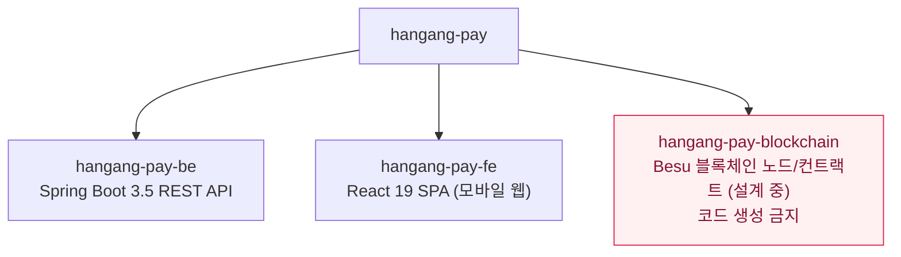
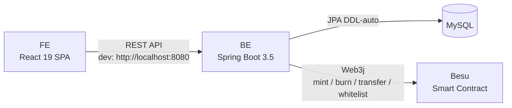
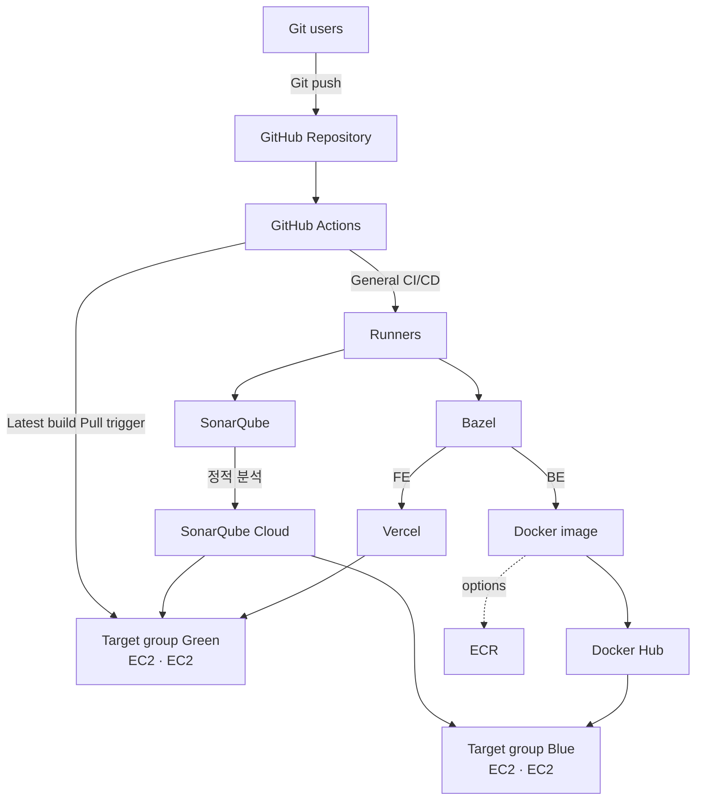
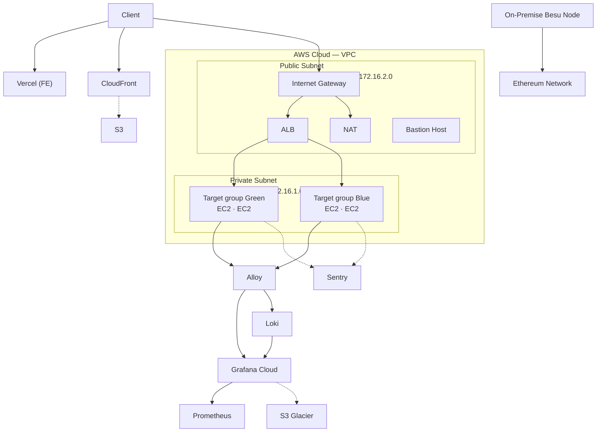

# hangang-pay

성동구 지역화폐 PG(Payment Gateway) 결제 시스템. FIS 아카데미 클라우드 6기 최종 프로젝트.
사용자는 지역화폐를 10% 할인된 가격으로 충전하고 지역 가맹점에서 간편하게 결제할 수 있으며, 환불 및 은행 간 정산은 한국은행 CBDC 기반으로 안전하게 처리됩니다.

## Repository Structure



Sub-project relations:


- `hangang-pay-blockchain/`에 코드 생성 금지 (모듈 설계 확정 전)

## 확정 배포 아키텍처 (Deployment Architecture)

**실제 배포 대상.** 리팩토링·설정은 이 토폴로지를 기준으로 한다. (아래 Deploy/Operations Diagram은 참고용 설계.)

| 영역 | 구성 | 위치 |
|---|---|---|
| 플랫폼 | `hangang-pay-be` + DB + Redis | **AWS** (전부) |
| 은행 | `hangang-pay-bank` + DB + Redis + RabbitMQ + besu ×4 | **on-prem OpenStack** (전부) |
| Blockscout | postgres + backend + frontend + nginx | **로컬 확인용 · 배포 X** |
| FE | `hangang-pay-fe` (React) | **Vercel** |
| 연결 | AWS ↔ on-prem | **Tailscale** 사설 메시 |

- **on-prem 실행 환경**: OpenStack 2025.1 (Epoxy) 단일노드 AIO / Ubuntu 24.04 Hyper-V VM / **qemu** / VM RAM 20GB (인스턴스용 예산 ~10GB).
- **메모리 제약**: OpenStack 인스턴스의 JVM(bank·besu)은 **`-Xmx512m`**. DB·Redis·RabbitMQ는 **인스턴스가 아닌 컨테이너**로 운영.
- **설정 외부화(필수)**: DB/Redis/RabbitMQ/besu 엔드포인트 하드코딩 금지 → **프로파일/환경변수**(`local`/`aws`/`onprem`). 플랫폼→AWS(RDS·ElastiCache), 은행→on-prem(컨테이너·besu RPC). AWS↔on-prem 통신은 **Tailscale 사설 IP**.
- **Blockscout**(블록체인 익스플로러 = postgres+backend+frontend+nginx)는 **개발 확인용 로컬 스택**이며 프로덕션 배포 대상 아님.

## Deploy Diagram



> **Todo:** 토큰(블록체인) 관련 빌드 단계 추가 필요 — 사용 툴 미확정

## Operations Diagram

Besu 노드는 온프레미스 가정.



## Branch Convention

브랜치는 반드시 Jira 이슈에서 생성. `main`은 보호 브랜치(직접 push 금지).

네이밍: `HANGANG-{번호}-{설명}`


Types: `feat` `fix` `chore` `refactor` `docs` `test` `style`

## Commit Convention

`.gitmessage` 템플릿 사용. `git commit -m` 사용 금지(템플릿 미적용).
팀원 각자 최초 1회 실행: `git config commit.template .gitmessage`

형식:
```
<type>: <제목>

본문 - 무엇을, 왜 변경했는지
```

## PR Convention

제목: `[HANGANG-{번호}] <type>: 작업 내용 한 줄 요약`
템플릿: `.github/PULL_REQUEST_TEMPLATE.md`

## What NOT to Do

- secrets/credentials/.env 커밋 금지 → 로컬 설정은 `application-local.yaml` (gitignored)
- `main`에 직접 push 금지
- BE·FE 변경을 하나의 커밋에 혼용 금지
- `hangang-pay-blockchain/`에 코드 생성 금지
- AI 에이전트(Claude/Codex 등)는 git commit을 생성하지 않는다 — 커밋은 사용자가 직접 한다. (브랜치 생성도 금지)
